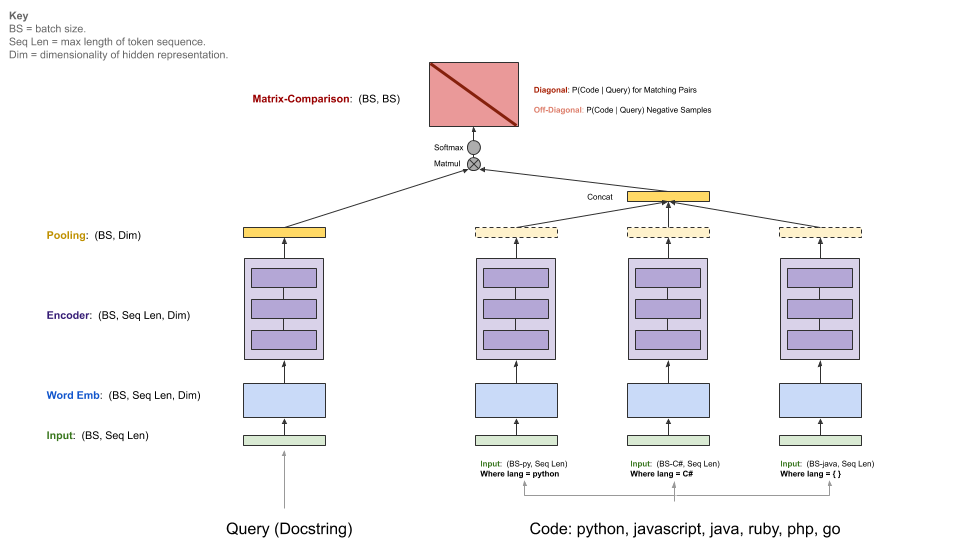

# 开发者搜索 Developer Search 

## 软件依赖

- 开发工具
    - Visual Studio Code
        - [Linux服务器远程连接](https://blankspace.blog.csdn.net/article/details/127764676)
        - [VSCode通过虚拟环境运行Python程序](https://blankspace.blog.csdn.net/article/details/127766482)
    - Chrome
    - Xshell
        - [Linux服务器远程连接](https://blankspace.blog.csdn.net/article/details/127764676)
    - Xftp
        - [Linux服务器远程连接](https://blankspace.blog.csdn.net/article/details/127764676)
- 开发语言
    - Python
    - JavaScript
- 软件工具
    - Elasticsearch
        - 软件版本：7.0.1 (锁版本)
        - 下载链接：`wget https://artifacts.elastic.co/downloads/elasticsearch/elasticsearch-7.0.1-linux-x86_64.tar.gz`
        - 解压文件：`tar -zxvf elasticsearch-7.0.1-linux-x86_64.tar.gz`
        - 开启窗口：`screen -S es`
        - 启动程序：`./elasticsearch-7.0.1-linux-x86_64/bin/elasticsearch`
        - 隐藏窗口：Ctrl + A + D
        - 检验启动：`curl localhost:9200`
    - Miniconda/Anaconda (不锁版本)
        - [Python开发环境搭建](https://blankspace.blog.csdn.net/article/details/129352680)
        - [Python包管理工具pip](https://blog.csdn.net/weixin_43896318/article/details/115771621)

## 启动运行

1. 下载并安装Conda环境(Anaconda或Miniconda)
2. 创建虚拟环境：`conda create --name developer_search python==3.8`
3. 进入虚拟环境：`conda activate developer_search`
4. 切换到`src`目录(cd命令)
5. 下载项目依赖(pip)：`pip install -r requirements.txt`
6. 启动Flask：`python developer_search.py`
7. 转发端口到浏览器：`http://localhost:5000`


## 工程结构

├──&nbsp;data<br>
│&nbsp;&nbsp;&nbsp;├──&nbsp;codesearch<br>
│&nbsp;&nbsp;&nbsp;│&nbsp;&nbsp;&nbsp;├──&nbsp;data_source<br>
│&nbsp;&nbsp;&nbsp;│&nbsp;&nbsp;&nbsp;│&nbsp;&nbsp;&nbsp;├──&nbsp;data0.pkl<br>
│&nbsp;&nbsp;&nbsp;│&nbsp;&nbsp;&nbsp;│&nbsp;&nbsp;&nbsp;├──&nbsp;data100.pkl<br>
│&nbsp;&nbsp;&nbsp;│&nbsp;&nbsp;&nbsp;│&nbsp;&nbsp;&nbsp;├──&nbsp;data101.pkl<br>
│&nbsp;&nbsp;&nbsp;│&nbsp;&nbsp;&nbsp;│&nbsp;&nbsp;&nbsp;├──&nbsp;data102.pkl<br>
│&nbsp;&nbsp;&nbsp;│&nbsp;&nbsp;&nbsp;│&nbsp;&nbsp;&nbsp;├──&nbsp;data103.pkl<br>
│&nbsp;&nbsp;&nbsp;│&nbsp;&nbsp;&nbsp;│&nbsp;&nbsp;&nbsp;├──&nbsp;data104.pkl<br>
│&nbsp;&nbsp;&nbsp;│&nbsp;&nbsp;&nbsp;│&nbsp;&nbsp;&nbsp;├──&nbsp;data105.pkl<br>
│&nbsp;&nbsp;&nbsp;│&nbsp;&nbsp;&nbsp;│&nbsp;&nbsp;&nbsp;├──&nbsp;data106.pkl<br>
│&nbsp;&nbsp;&nbsp;│&nbsp;&nbsp;&nbsp;│&nbsp;&nbsp;&nbsp;├──&nbsp;data107.pkl<br>
│&nbsp;&nbsp;&nbsp;│&nbsp;&nbsp;&nbsp;│&nbsp;&nbsp;&nbsp;├──&nbsp;data108.pkl<br>
│&nbsp;&nbsp;&nbsp;│&nbsp;&nbsp;&nbsp;│&nbsp;&nbsp;&nbsp;├──&nbsp;data109.pkl<br>
│&nbsp;&nbsp;&nbsp;│&nbsp;&nbsp;&nbsp;│&nbsp;&nbsp;&nbsp;├──&nbsp;data10.pkl<br>
│&nbsp;&nbsp;&nbsp;│&nbsp;&nbsp;&nbsp;│&nbsp;&nbsp;&nbsp;├──&nbsp;data110.pkl<br>
│&nbsp;&nbsp;&nbsp;│&nbsp;&nbsp;&nbsp;│&nbsp;&nbsp;&nbsp;├──&nbsp;data111.pkl<br>
│&nbsp;&nbsp;&nbsp;│&nbsp;&nbsp;&nbsp;│&nbsp;&nbsp;&nbsp;├──&nbsp;data112.pkl<br>
│&nbsp;&nbsp;&nbsp;│&nbsp;&nbsp;&nbsp;│&nbsp;&nbsp;&nbsp;├──&nbsp;data113.pkl<br>
│&nbsp;&nbsp;&nbsp;│&nbsp;&nbsp;&nbsp;│&nbsp;&nbsp;&nbsp;├──&nbsp;data114.pkl<br>
│&nbsp;&nbsp;&nbsp;│&nbsp;&nbsp;&nbsp;│&nbsp;&nbsp;&nbsp;├──&nbsp;data115.pkl<br>
│&nbsp;&nbsp;&nbsp;│&nbsp;&nbsp;&nbsp;│&nbsp;&nbsp;&nbsp;├──&nbsp;data116.pkl<br>
│&nbsp;&nbsp;&nbsp;│&nbsp;&nbsp;&nbsp;│&nbsp;&nbsp;&nbsp;├──&nbsp;data117.pkl<br>
│&nbsp;&nbsp;&nbsp;│&nbsp;&nbsp;&nbsp;│&nbsp;&nbsp;&nbsp;├──&nbsp;data118.pkl<br>
│&nbsp;&nbsp;&nbsp;│&nbsp;&nbsp;&nbsp;│&nbsp;&nbsp;&nbsp;├──&nbsp;data119.pkl<br>
│&nbsp;&nbsp;&nbsp;│&nbsp;&nbsp;&nbsp;│&nbsp;&nbsp;&nbsp;├──&nbsp;data11.pkl<br>
│&nbsp;&nbsp;&nbsp;│&nbsp;&nbsp;&nbsp;│&nbsp;&nbsp;&nbsp;├──&nbsp;data120.pkl<br>
│&nbsp;&nbsp;&nbsp;│&nbsp;&nbsp;&nbsp;│&nbsp;&nbsp;&nbsp;├──&nbsp;data121.pkl<br>
│&nbsp;&nbsp;&nbsp;│&nbsp;&nbsp;&nbsp;│&nbsp;&nbsp;&nbsp;├──&nbsp;data122.pkl<br>
│&nbsp;&nbsp;&nbsp;│&nbsp;&nbsp;&nbsp;│&nbsp;&nbsp;&nbsp;├──&nbsp;data123.pkl<br>
│&nbsp;&nbsp;&nbsp;│&nbsp;&nbsp;&nbsp;│&nbsp;&nbsp;&nbsp;├──&nbsp;data124.pkl<br>
│&nbsp;&nbsp;&nbsp;│&nbsp;&nbsp;&nbsp;│&nbsp;&nbsp;&nbsp;├──&nbsp;data125.pkl<br>
│&nbsp;&nbsp;&nbsp;│&nbsp;&nbsp;&nbsp;│&nbsp;&nbsp;&nbsp;├──&nbsp;data126.pkl<br>
│&nbsp;&nbsp;&nbsp;│&nbsp;&nbsp;&nbsp;│&nbsp;&nbsp;&nbsp;├──&nbsp;data127.pkl<br>
│&nbsp;&nbsp;&nbsp;│&nbsp;&nbsp;&nbsp;│&nbsp;&nbsp;&nbsp;├──&nbsp;data128.pkl<br>
│&nbsp;&nbsp;&nbsp;│&nbsp;&nbsp;&nbsp;│&nbsp;&nbsp;&nbsp;├──&nbsp;data129.pkl<br>
│&nbsp;&nbsp;&nbsp;│&nbsp;&nbsp;&nbsp;│&nbsp;&nbsp;&nbsp;├──&nbsp;data12.pkl<br>
│&nbsp;&nbsp;&nbsp;│&nbsp;&nbsp;&nbsp;│&nbsp;&nbsp;&nbsp;├──&nbsp;data130.pkl<br>
│&nbsp;&nbsp;&nbsp;│&nbsp;&nbsp;&nbsp;│&nbsp;&nbsp;&nbsp;├──&nbsp;data131.pkl<br>
│&nbsp;&nbsp;&nbsp;│&nbsp;&nbsp;&nbsp;│&nbsp;&nbsp;&nbsp;├──&nbsp;data132.pkl<br>
│&nbsp;&nbsp;&nbsp;│&nbsp;&nbsp;&nbsp;│&nbsp;&nbsp;&nbsp;├──&nbsp;data133.pkl<br>
│&nbsp;&nbsp;&nbsp;│&nbsp;&nbsp;&nbsp;│&nbsp;&nbsp;&nbsp;├──&nbsp;data134.pkl<br>
│&nbsp;&nbsp;&nbsp;│&nbsp;&nbsp;&nbsp;│&nbsp;&nbsp;&nbsp;├──&nbsp;data135.pkl<br>
│&nbsp;&nbsp;&nbsp;│&nbsp;&nbsp;&nbsp;│&nbsp;&nbsp;&nbsp;├──&nbsp;data136.pkl<br>
│&nbsp;&nbsp;&nbsp;│&nbsp;&nbsp;&nbsp;│&nbsp;&nbsp;&nbsp;├──&nbsp;data137.pkl<br>
│&nbsp;&nbsp;&nbsp;│&nbsp;&nbsp;&nbsp;│&nbsp;&nbsp;&nbsp;├──&nbsp;data138.pkl<br>
│&nbsp;&nbsp;&nbsp;│&nbsp;&nbsp;&nbsp;│&nbsp;&nbsp;&nbsp;├──&nbsp;data139.pkl<br>
│&nbsp;&nbsp;&nbsp;│&nbsp;&nbsp;&nbsp;│&nbsp;&nbsp;&nbsp;├──&nbsp;data13.pkl<br>
│&nbsp;&nbsp;&nbsp;│&nbsp;&nbsp;&nbsp;│&nbsp;&nbsp;&nbsp;├──&nbsp;data140.pkl<br>
│&nbsp;&nbsp;&nbsp;│&nbsp;&nbsp;&nbsp;│&nbsp;&nbsp;&nbsp;├──&nbsp;data141.pkl<br>
│&nbsp;&nbsp;&nbsp;│&nbsp;&nbsp;&nbsp;│&nbsp;&nbsp;&nbsp;├──&nbsp;data142.pkl<br>
│&nbsp;&nbsp;&nbsp;│&nbsp;&nbsp;&nbsp;│&nbsp;&nbsp;&nbsp;├──&nbsp;data143.pkl<br>
│&nbsp;&nbsp;&nbsp;│&nbsp;&nbsp;&nbsp;│&nbsp;&nbsp;&nbsp;├──&nbsp;data144.pkl<br>
│&nbsp;&nbsp;&nbsp;│&nbsp;&nbsp;&nbsp;│&nbsp;&nbsp;&nbsp;├──&nbsp;data145.pkl<br>
│&nbsp;&nbsp;&nbsp;│&nbsp;&nbsp;&nbsp;│&nbsp;&nbsp;&nbsp;├──&nbsp;data146.pkl<br>
│&nbsp;&nbsp;&nbsp;│&nbsp;&nbsp;&nbsp;│&nbsp;&nbsp;&nbsp;├──&nbsp;data147.pkl<br>
│&nbsp;&nbsp;&nbsp;│&nbsp;&nbsp;&nbsp;│&nbsp;&nbsp;&nbsp;├──&nbsp;data148.pkl<br>
│&nbsp;&nbsp;&nbsp;│&nbsp;&nbsp;&nbsp;│&nbsp;&nbsp;&nbsp;├──&nbsp;data149.pkl<br>
│&nbsp;&nbsp;&nbsp;│&nbsp;&nbsp;&nbsp;│&nbsp;&nbsp;&nbsp;├──&nbsp;data14.pkl<br>
│&nbsp;&nbsp;&nbsp;│&nbsp;&nbsp;&nbsp;│&nbsp;&nbsp;&nbsp;├──&nbsp;data150.pkl<br>
│&nbsp;&nbsp;&nbsp;│&nbsp;&nbsp;&nbsp;│&nbsp;&nbsp;&nbsp;├──&nbsp;data151.pkl<br>
│&nbsp;&nbsp;&nbsp;│&nbsp;&nbsp;&nbsp;│&nbsp;&nbsp;&nbsp;├──&nbsp;data152.pkl<br>
│&nbsp;&nbsp;&nbsp;│&nbsp;&nbsp;&nbsp;│&nbsp;&nbsp;&nbsp;├──&nbsp;data153.pkl<br>
│&nbsp;&nbsp;&nbsp;│&nbsp;&nbsp;&nbsp;│&nbsp;&nbsp;&nbsp;├──&nbsp;data154.pkl<br>
│&nbsp;&nbsp;&nbsp;│&nbsp;&nbsp;&nbsp;│&nbsp;&nbsp;&nbsp;├──&nbsp;data155.pkl<br>
│&nbsp;&nbsp;&nbsp;│&nbsp;&nbsp;&nbsp;│&nbsp;&nbsp;&nbsp;├──&nbsp;data156.pkl<br>
│&nbsp;&nbsp;&nbsp;│&nbsp;&nbsp;&nbsp;│&nbsp;&nbsp;&nbsp;├──&nbsp;data157.pkl<br>
│&nbsp;&nbsp;&nbsp;│&nbsp;&nbsp;&nbsp;│&nbsp;&nbsp;&nbsp;├──&nbsp;data158.pkl<br>
│&nbsp;&nbsp;&nbsp;│&nbsp;&nbsp;&nbsp;│&nbsp;&nbsp;&nbsp;├──&nbsp;data159.pkl<br>
│&nbsp;&nbsp;&nbsp;│&nbsp;&nbsp;&nbsp;│&nbsp;&nbsp;&nbsp;├──&nbsp;data15.pkl<br>
│&nbsp;&nbsp;&nbsp;│&nbsp;&nbsp;&nbsp;│&nbsp;&nbsp;&nbsp;├──&nbsp;data160.pkl<br>
│&nbsp;&nbsp;&nbsp;│&nbsp;&nbsp;&nbsp;│&nbsp;&nbsp;&nbsp;├──&nbsp;data161.pkl<br>
│&nbsp;&nbsp;&nbsp;│&nbsp;&nbsp;&nbsp;│&nbsp;&nbsp;&nbsp;├──&nbsp;data162.pkl<br>
│&nbsp;&nbsp;&nbsp;│&nbsp;&nbsp;&nbsp;│&nbsp;&nbsp;&nbsp;├──&nbsp;data163.pkl<br>
│&nbsp;&nbsp;&nbsp;│&nbsp;&nbsp;&nbsp;│&nbsp;&nbsp;&nbsp;├──&nbsp;data164.pkl<br>
│&nbsp;&nbsp;&nbsp;│&nbsp;&nbsp;&nbsp;│&nbsp;&nbsp;&nbsp;├──&nbsp;data165.pkl<br>
│&nbsp;&nbsp;&nbsp;│&nbsp;&nbsp;&nbsp;│&nbsp;&nbsp;&nbsp;├──&nbsp;data16.pkl<br>
│&nbsp;&nbsp;&nbsp;│&nbsp;&nbsp;&nbsp;│&nbsp;&nbsp;&nbsp;├──&nbsp;data17.pkl<br>
│&nbsp;&nbsp;&nbsp;│&nbsp;&nbsp;&nbsp;│&nbsp;&nbsp;&nbsp;├──&nbsp;data18.pkl<br>
│&nbsp;&nbsp;&nbsp;│&nbsp;&nbsp;&nbsp;│&nbsp;&nbsp;&nbsp;├──&nbsp;data19.pkl<br>
│&nbsp;&nbsp;&nbsp;│&nbsp;&nbsp;&nbsp;│&nbsp;&nbsp;&nbsp;├──&nbsp;data1.pkl<br>
│&nbsp;&nbsp;&nbsp;│&nbsp;&nbsp;&nbsp;│&nbsp;&nbsp;&nbsp;├──&nbsp;data20.pkl<br>
│&nbsp;&nbsp;&nbsp;│&nbsp;&nbsp;&nbsp;│&nbsp;&nbsp;&nbsp;├──&nbsp;data21.pkl<br>
│&nbsp;&nbsp;&nbsp;│&nbsp;&nbsp;&nbsp;│&nbsp;&nbsp;&nbsp;├──&nbsp;data22.pkl<br>
│&nbsp;&nbsp;&nbsp;│&nbsp;&nbsp;&nbsp;│&nbsp;&nbsp;&nbsp;├──&nbsp;data23.pkl<br>
│&nbsp;&nbsp;&nbsp;│&nbsp;&nbsp;&nbsp;│&nbsp;&nbsp;&nbsp;├──&nbsp;data24.pkl<br>
│&nbsp;&nbsp;&nbsp;│&nbsp;&nbsp;&nbsp;│&nbsp;&nbsp;&nbsp;├──&nbsp;data25.pkl<br>
│&nbsp;&nbsp;&nbsp;│&nbsp;&nbsp;&nbsp;│&nbsp;&nbsp;&nbsp;├──&nbsp;data26.pkl<br>
│&nbsp;&nbsp;&nbsp;│&nbsp;&nbsp;&nbsp;│&nbsp;&nbsp;&nbsp;├──&nbsp;data27.pkl<br>
│&nbsp;&nbsp;&nbsp;│&nbsp;&nbsp;&nbsp;│&nbsp;&nbsp;&nbsp;├──&nbsp;data28.pkl<br>
│&nbsp;&nbsp;&nbsp;│&nbsp;&nbsp;&nbsp;│&nbsp;&nbsp;&nbsp;├──&nbsp;data29.pkl<br>
│&nbsp;&nbsp;&nbsp;│&nbsp;&nbsp;&nbsp;│&nbsp;&nbsp;&nbsp;├──&nbsp;data2.pkl<br>
│&nbsp;&nbsp;&nbsp;│&nbsp;&nbsp;&nbsp;│&nbsp;&nbsp;&nbsp;├──&nbsp;data30.pkl<br>
│&nbsp;&nbsp;&nbsp;│&nbsp;&nbsp;&nbsp;│&nbsp;&nbsp;&nbsp;├──&nbsp;data31.pkl<br>
│&nbsp;&nbsp;&nbsp;│&nbsp;&nbsp;&nbsp;│&nbsp;&nbsp;&nbsp;├──&nbsp;data32.pkl<br>
│&nbsp;&nbsp;&nbsp;│&nbsp;&nbsp;&nbsp;│&nbsp;&nbsp;&nbsp;├──&nbsp;data33.pkl<br>
│&nbsp;&nbsp;&nbsp;│&nbsp;&nbsp;&nbsp;│&nbsp;&nbsp;&nbsp;├──&nbsp;data34.pkl<br>
│&nbsp;&nbsp;&nbsp;│&nbsp;&nbsp;&nbsp;│&nbsp;&nbsp;&nbsp;├──&nbsp;data35.pkl<br>
│&nbsp;&nbsp;&nbsp;│&nbsp;&nbsp;&nbsp;│&nbsp;&nbsp;&nbsp;├──&nbsp;data36.pkl<br>
│&nbsp;&nbsp;&nbsp;│&nbsp;&nbsp;&nbsp;│&nbsp;&nbsp;&nbsp;├──&nbsp;data37.pkl<br>
│&nbsp;&nbsp;&nbsp;│&nbsp;&nbsp;&nbsp;│&nbsp;&nbsp;&nbsp;├──&nbsp;data38.pkl<br>
│&nbsp;&nbsp;&nbsp;│&nbsp;&nbsp;&nbsp;│&nbsp;&nbsp;&nbsp;├──&nbsp;data39.pkl<br>
│&nbsp;&nbsp;&nbsp;│&nbsp;&nbsp;&nbsp;│&nbsp;&nbsp;&nbsp;├──&nbsp;data3.pkl<br>
│&nbsp;&nbsp;&nbsp;│&nbsp;&nbsp;&nbsp;│&nbsp;&nbsp;&nbsp;├──&nbsp;data40.pkl<br>
│&nbsp;&nbsp;&nbsp;│&nbsp;&nbsp;&nbsp;│&nbsp;&nbsp;&nbsp;├──&nbsp;data41.pkl<br>
│&nbsp;&nbsp;&nbsp;│&nbsp;&nbsp;&nbsp;│&nbsp;&nbsp;&nbsp;├──&nbsp;data42.pkl<br>
│&nbsp;&nbsp;&nbsp;│&nbsp;&nbsp;&nbsp;│&nbsp;&nbsp;&nbsp;├──&nbsp;data43.pkl<br>
│&nbsp;&nbsp;&nbsp;│&nbsp;&nbsp;&nbsp;│&nbsp;&nbsp;&nbsp;├──&nbsp;data44.pkl<br>
│&nbsp;&nbsp;&nbsp;│&nbsp;&nbsp;&nbsp;│&nbsp;&nbsp;&nbsp;├──&nbsp;data45.pkl<br>
│&nbsp;&nbsp;&nbsp;│&nbsp;&nbsp;&nbsp;│&nbsp;&nbsp;&nbsp;├──&nbsp;data46.pkl<br>
│&nbsp;&nbsp;&nbsp;│&nbsp;&nbsp;&nbsp;│&nbsp;&nbsp;&nbsp;├──&nbsp;data47.pkl<br>
│&nbsp;&nbsp;&nbsp;│&nbsp;&nbsp;&nbsp;│&nbsp;&nbsp;&nbsp;├──&nbsp;data48.pkl<br>
│&nbsp;&nbsp;&nbsp;│&nbsp;&nbsp;&nbsp;│&nbsp;&nbsp;&nbsp;├──&nbsp;data49.pkl<br>
│&nbsp;&nbsp;&nbsp;│&nbsp;&nbsp;&nbsp;│&nbsp;&nbsp;&nbsp;├──&nbsp;data4.pkl<br>
│&nbsp;&nbsp;&nbsp;│&nbsp;&nbsp;&nbsp;│&nbsp;&nbsp;&nbsp;├──&nbsp;data50.pkl<br>
│&nbsp;&nbsp;&nbsp;│&nbsp;&nbsp;&nbsp;│&nbsp;&nbsp;&nbsp;├──&nbsp;data51.pkl<br>
│&nbsp;&nbsp;&nbsp;│&nbsp;&nbsp;&nbsp;│&nbsp;&nbsp;&nbsp;├──&nbsp;data52.pkl<br>
│&nbsp;&nbsp;&nbsp;│&nbsp;&nbsp;&nbsp;│&nbsp;&nbsp;&nbsp;├──&nbsp;data53.pkl<br>
│&nbsp;&nbsp;&nbsp;│&nbsp;&nbsp;&nbsp;│&nbsp;&nbsp;&nbsp;├──&nbsp;data54.pkl<br>
│&nbsp;&nbsp;&nbsp;│&nbsp;&nbsp;&nbsp;│&nbsp;&nbsp;&nbsp;├──&nbsp;data55.pkl<br>
│&nbsp;&nbsp;&nbsp;│&nbsp;&nbsp;&nbsp;│&nbsp;&nbsp;&nbsp;├──&nbsp;data56.pkl<br>
│&nbsp;&nbsp;&nbsp;│&nbsp;&nbsp;&nbsp;│&nbsp;&nbsp;&nbsp;├──&nbsp;data57.pkl<br>
│&nbsp;&nbsp;&nbsp;│&nbsp;&nbsp;&nbsp;│&nbsp;&nbsp;&nbsp;├──&nbsp;data58.pkl<br>
│&nbsp;&nbsp;&nbsp;│&nbsp;&nbsp;&nbsp;│&nbsp;&nbsp;&nbsp;├──&nbsp;data59.pkl<br>
│&nbsp;&nbsp;&nbsp;│&nbsp;&nbsp;&nbsp;│&nbsp;&nbsp;&nbsp;├──&nbsp;data5.pkl<br>
│&nbsp;&nbsp;&nbsp;│&nbsp;&nbsp;&nbsp;│&nbsp;&nbsp;&nbsp;├──&nbsp;data60.pkl<br>
│&nbsp;&nbsp;&nbsp;│&nbsp;&nbsp;&nbsp;│&nbsp;&nbsp;&nbsp;├──&nbsp;data61.pkl<br>
│&nbsp;&nbsp;&nbsp;│&nbsp;&nbsp;&nbsp;│&nbsp;&nbsp;&nbsp;├──&nbsp;data62.pkl<br>
│&nbsp;&nbsp;&nbsp;│&nbsp;&nbsp;&nbsp;│&nbsp;&nbsp;&nbsp;├──&nbsp;data63.pkl<br>
│&nbsp;&nbsp;&nbsp;│&nbsp;&nbsp;&nbsp;│&nbsp;&nbsp;&nbsp;├──&nbsp;data64.pkl<br>
│&nbsp;&nbsp;&nbsp;│&nbsp;&nbsp;&nbsp;│&nbsp;&nbsp;&nbsp;├──&nbsp;data65.pkl<br>
│&nbsp;&nbsp;&nbsp;│&nbsp;&nbsp;&nbsp;│&nbsp;&nbsp;&nbsp;├──&nbsp;data66.pkl<br>
│&nbsp;&nbsp;&nbsp;│&nbsp;&nbsp;&nbsp;│&nbsp;&nbsp;&nbsp;├──&nbsp;data67.pkl<br>
│&nbsp;&nbsp;&nbsp;│&nbsp;&nbsp;&nbsp;│&nbsp;&nbsp;&nbsp;├──&nbsp;data68.pkl<br>
│&nbsp;&nbsp;&nbsp;│&nbsp;&nbsp;&nbsp;│&nbsp;&nbsp;&nbsp;├──&nbsp;data69.pkl<br>
│&nbsp;&nbsp;&nbsp;│&nbsp;&nbsp;&nbsp;│&nbsp;&nbsp;&nbsp;├──&nbsp;data6.pkl<br>
│&nbsp;&nbsp;&nbsp;│&nbsp;&nbsp;&nbsp;│&nbsp;&nbsp;&nbsp;├──&nbsp;data70.pkl<br>
│&nbsp;&nbsp;&nbsp;│&nbsp;&nbsp;&nbsp;│&nbsp;&nbsp;&nbsp;├──&nbsp;data71.pkl<br>
│&nbsp;&nbsp;&nbsp;│&nbsp;&nbsp;&nbsp;│&nbsp;&nbsp;&nbsp;├──&nbsp;data72.pkl<br>
│&nbsp;&nbsp;&nbsp;│&nbsp;&nbsp;&nbsp;│&nbsp;&nbsp;&nbsp;├──&nbsp;data73.pkl<br>
│&nbsp;&nbsp;&nbsp;│&nbsp;&nbsp;&nbsp;│&nbsp;&nbsp;&nbsp;├──&nbsp;data74.pkl<br>
│&nbsp;&nbsp;&nbsp;│&nbsp;&nbsp;&nbsp;│&nbsp;&nbsp;&nbsp;├──&nbsp;data75.pkl<br>
│&nbsp;&nbsp;&nbsp;│&nbsp;&nbsp;&nbsp;│&nbsp;&nbsp;&nbsp;├──&nbsp;data76.pkl<br>
│&nbsp;&nbsp;&nbsp;│&nbsp;&nbsp;&nbsp;│&nbsp;&nbsp;&nbsp;├──&nbsp;data77.pkl<br>
│&nbsp;&nbsp;&nbsp;│&nbsp;&nbsp;&nbsp;│&nbsp;&nbsp;&nbsp;├──&nbsp;data78.pkl<br>
│&nbsp;&nbsp;&nbsp;│&nbsp;&nbsp;&nbsp;│&nbsp;&nbsp;&nbsp;├──&nbsp;data79.pkl<br>
│&nbsp;&nbsp;&nbsp;│&nbsp;&nbsp;&nbsp;│&nbsp;&nbsp;&nbsp;├──&nbsp;data7.pkl<br>
│&nbsp;&nbsp;&nbsp;│&nbsp;&nbsp;&nbsp;│&nbsp;&nbsp;&nbsp;├──&nbsp;data80.pkl<br>
│&nbsp;&nbsp;&nbsp;│&nbsp;&nbsp;&nbsp;│&nbsp;&nbsp;&nbsp;├──&nbsp;data81.pkl<br>
│&nbsp;&nbsp;&nbsp;│&nbsp;&nbsp;&nbsp;│&nbsp;&nbsp;&nbsp;├──&nbsp;data82.pkl<br>
│&nbsp;&nbsp;&nbsp;│&nbsp;&nbsp;&nbsp;│&nbsp;&nbsp;&nbsp;├──&nbsp;data83.pkl<br>
│&nbsp;&nbsp;&nbsp;│&nbsp;&nbsp;&nbsp;│&nbsp;&nbsp;&nbsp;├──&nbsp;data84.pkl<br>
│&nbsp;&nbsp;&nbsp;│&nbsp;&nbsp;&nbsp;│&nbsp;&nbsp;&nbsp;├──&nbsp;data85.pkl<br>
│&nbsp;&nbsp;&nbsp;│&nbsp;&nbsp;&nbsp;│&nbsp;&nbsp;&nbsp;├──&nbsp;data86.pkl<br>
│&nbsp;&nbsp;&nbsp;│&nbsp;&nbsp;&nbsp;│&nbsp;&nbsp;&nbsp;├──&nbsp;data87.pkl<br>
│&nbsp;&nbsp;&nbsp;│&nbsp;&nbsp;&nbsp;│&nbsp;&nbsp;&nbsp;├──&nbsp;data88.pkl<br>
│&nbsp;&nbsp;&nbsp;│&nbsp;&nbsp;&nbsp;│&nbsp;&nbsp;&nbsp;├──&nbsp;data89.pkl<br>
│&nbsp;&nbsp;&nbsp;│&nbsp;&nbsp;&nbsp;│&nbsp;&nbsp;&nbsp;├──&nbsp;data8.pkl<br>
│&nbsp;&nbsp;&nbsp;│&nbsp;&nbsp;&nbsp;│&nbsp;&nbsp;&nbsp;├──&nbsp;data90.pkl<br>
│&nbsp;&nbsp;&nbsp;│&nbsp;&nbsp;&nbsp;│&nbsp;&nbsp;&nbsp;├──&nbsp;data91.pkl<br>
│&nbsp;&nbsp;&nbsp;│&nbsp;&nbsp;&nbsp;│&nbsp;&nbsp;&nbsp;├──&nbsp;data92.pkl<br>
│&nbsp;&nbsp;&nbsp;│&nbsp;&nbsp;&nbsp;│&nbsp;&nbsp;&nbsp;├──&nbsp;data93.pkl<br>
│&nbsp;&nbsp;&nbsp;│&nbsp;&nbsp;&nbsp;│&nbsp;&nbsp;&nbsp;├──&nbsp;data94.pkl<br>
│&nbsp;&nbsp;&nbsp;│&nbsp;&nbsp;&nbsp;│&nbsp;&nbsp;&nbsp;├──&nbsp;data95.pkl<br>
│&nbsp;&nbsp;&nbsp;│&nbsp;&nbsp;&nbsp;│&nbsp;&nbsp;&nbsp;├──&nbsp;data96.pkl<br>
│&nbsp;&nbsp;&nbsp;│&nbsp;&nbsp;&nbsp;│&nbsp;&nbsp;&nbsp;├──&nbsp;data97.pkl<br>
│&nbsp;&nbsp;&nbsp;│&nbsp;&nbsp;&nbsp;│&nbsp;&nbsp;&nbsp;├──&nbsp;data98.pkl<br>
│&nbsp;&nbsp;&nbsp;│&nbsp;&nbsp;&nbsp;│&nbsp;&nbsp;&nbsp;├──&nbsp;data99.pkl<br>
│&nbsp;&nbsp;&nbsp;│&nbsp;&nbsp;&nbsp;│&nbsp;&nbsp;&nbsp;└──&nbsp;data9.pkl<br>
│&nbsp;&nbsp;&nbsp;│&nbsp;&nbsp;&nbsp;├──&nbsp;java_test_0.jsonl.gz<br>
│&nbsp;&nbsp;&nbsp;│&nbsp;&nbsp;&nbsp;├──&nbsp;test<br>
│&nbsp;&nbsp;&nbsp;│&nbsp;&nbsp;&nbsp;│&nbsp;&nbsp;&nbsp;└──&nbsp;java<br>
│&nbsp;&nbsp;&nbsp;│&nbsp;&nbsp;&nbsp;│&nbsp;&nbsp;&nbsp;&nbsp;&nbsp;&nbsp;&nbsp;├──&nbsp;batch_0.txt<br>
│&nbsp;&nbsp;&nbsp;│&nbsp;&nbsp;&nbsp;│&nbsp;&nbsp;&nbsp;&nbsp;&nbsp;&nbsp;&nbsp;├──&nbsp;batch_10.txt<br>
│&nbsp;&nbsp;&nbsp;│&nbsp;&nbsp;&nbsp;│&nbsp;&nbsp;&nbsp;&nbsp;&nbsp;&nbsp;&nbsp;├──&nbsp;batch_11.txt<br>
│&nbsp;&nbsp;&nbsp;│&nbsp;&nbsp;&nbsp;│&nbsp;&nbsp;&nbsp;&nbsp;&nbsp;&nbsp;&nbsp;├──&nbsp;batch_121.txt<br>
│&nbsp;&nbsp;&nbsp;│&nbsp;&nbsp;&nbsp;│&nbsp;&nbsp;&nbsp;&nbsp;&nbsp;&nbsp;&nbsp;├──&nbsp;batch_12.txt<br>
│&nbsp;&nbsp;&nbsp;│&nbsp;&nbsp;&nbsp;│&nbsp;&nbsp;&nbsp;&nbsp;&nbsp;&nbsp;&nbsp;├──&nbsp;batch_13.txt<br>
│&nbsp;&nbsp;&nbsp;│&nbsp;&nbsp;&nbsp;│&nbsp;&nbsp;&nbsp;&nbsp;&nbsp;&nbsp;&nbsp;├──&nbsp;batch_14.txt<br>
│&nbsp;&nbsp;&nbsp;│&nbsp;&nbsp;&nbsp;│&nbsp;&nbsp;&nbsp;&nbsp;&nbsp;&nbsp;&nbsp;├──&nbsp;batch_15.txt<br>
│&nbsp;&nbsp;&nbsp;│&nbsp;&nbsp;&nbsp;│&nbsp;&nbsp;&nbsp;&nbsp;&nbsp;&nbsp;&nbsp;├──&nbsp;batch_16.txt<br>
│&nbsp;&nbsp;&nbsp;│&nbsp;&nbsp;&nbsp;│&nbsp;&nbsp;&nbsp;&nbsp;&nbsp;&nbsp;&nbsp;├──&nbsp;batch_17.txt<br>
│&nbsp;&nbsp;&nbsp;│&nbsp;&nbsp;&nbsp;│&nbsp;&nbsp;&nbsp;&nbsp;&nbsp;&nbsp;&nbsp;├──&nbsp;batch_18.txt<br>
│&nbsp;&nbsp;&nbsp;│&nbsp;&nbsp;&nbsp;│&nbsp;&nbsp;&nbsp;&nbsp;&nbsp;&nbsp;&nbsp;├──&nbsp;batch_19.txt<br>
│&nbsp;&nbsp;&nbsp;│&nbsp;&nbsp;&nbsp;│&nbsp;&nbsp;&nbsp;&nbsp;&nbsp;&nbsp;&nbsp;├──&nbsp;batch_1.txt<br>
│&nbsp;&nbsp;&nbsp;│&nbsp;&nbsp;&nbsp;│&nbsp;&nbsp;&nbsp;&nbsp;&nbsp;&nbsp;&nbsp;├──&nbsp;batch_20.txt<br>
│&nbsp;&nbsp;&nbsp;│&nbsp;&nbsp;&nbsp;│&nbsp;&nbsp;&nbsp;&nbsp;&nbsp;&nbsp;&nbsp;├──&nbsp;batch_21.txt<br>
│&nbsp;&nbsp;&nbsp;│&nbsp;&nbsp;&nbsp;│&nbsp;&nbsp;&nbsp;&nbsp;&nbsp;&nbsp;&nbsp;├──&nbsp;batch_22.txt<br>
│&nbsp;&nbsp;&nbsp;│&nbsp;&nbsp;&nbsp;│&nbsp;&nbsp;&nbsp;&nbsp;&nbsp;&nbsp;&nbsp;├──&nbsp;batch_23.txt<br>
│&nbsp;&nbsp;&nbsp;│&nbsp;&nbsp;&nbsp;│&nbsp;&nbsp;&nbsp;&nbsp;&nbsp;&nbsp;&nbsp;├──&nbsp;batch_24.txt<br>
│&nbsp;&nbsp;&nbsp;│&nbsp;&nbsp;&nbsp;│&nbsp;&nbsp;&nbsp;&nbsp;&nbsp;&nbsp;&nbsp;├──&nbsp;batch_25.txt<br>
│&nbsp;&nbsp;&nbsp;│&nbsp;&nbsp;&nbsp;│&nbsp;&nbsp;&nbsp;&nbsp;&nbsp;&nbsp;&nbsp;├──&nbsp;batch_2.txt<br>
│&nbsp;&nbsp;&nbsp;│&nbsp;&nbsp;&nbsp;│&nbsp;&nbsp;&nbsp;&nbsp;&nbsp;&nbsp;&nbsp;├──&nbsp;batch_3.txt<br>
│&nbsp;&nbsp;&nbsp;│&nbsp;&nbsp;&nbsp;│&nbsp;&nbsp;&nbsp;&nbsp;&nbsp;&nbsp;&nbsp;├──&nbsp;batch_4.txt<br>
│&nbsp;&nbsp;&nbsp;│&nbsp;&nbsp;&nbsp;│&nbsp;&nbsp;&nbsp;&nbsp;&nbsp;&nbsp;&nbsp;├──&nbsp;batch_5.txt<br>
│&nbsp;&nbsp;&nbsp;│&nbsp;&nbsp;&nbsp;│&nbsp;&nbsp;&nbsp;&nbsp;&nbsp;&nbsp;&nbsp;├──&nbsp;batch_6.txt<br>
│&nbsp;&nbsp;&nbsp;│&nbsp;&nbsp;&nbsp;│&nbsp;&nbsp;&nbsp;&nbsp;&nbsp;&nbsp;&nbsp;├──&nbsp;batch_7.txt<br>
│&nbsp;&nbsp;&nbsp;│&nbsp;&nbsp;&nbsp;│&nbsp;&nbsp;&nbsp;&nbsp;&nbsp;&nbsp;&nbsp;├──&nbsp;batch_8.txt<br>
│&nbsp;&nbsp;&nbsp;│&nbsp;&nbsp;&nbsp;│&nbsp;&nbsp;&nbsp;&nbsp;&nbsp;&nbsp;&nbsp;├──&nbsp;batch_9.txt<br>
│&nbsp;&nbsp;&nbsp;│&nbsp;&nbsp;&nbsp;│&nbsp;&nbsp;&nbsp;&nbsp;&nbsp;&nbsp;&nbsp;└──&nbsp;cached_test_batch_121_codebert_200_codesearch<br>
│&nbsp;&nbsp;&nbsp;│&nbsp;&nbsp;&nbsp;├──&nbsp;train.log<br>
│&nbsp;&nbsp;&nbsp;│&nbsp;&nbsp;&nbsp;└──&nbsp;train_valid<br>
│&nbsp;&nbsp;&nbsp;│&nbsp;&nbsp;&nbsp;&nbsp;&nbsp;&nbsp;&nbsp;└──&nbsp;java<br>
│&nbsp;&nbsp;&nbsp;│&nbsp;&nbsp;&nbsp;&nbsp;&nbsp;&nbsp;&nbsp;&nbsp;&nbsp;&nbsp;&nbsp;├──&nbsp;cached_dev_valid_codebert_200_codesearch<br>
│&nbsp;&nbsp;&nbsp;│&nbsp;&nbsp;&nbsp;&nbsp;&nbsp;&nbsp;&nbsp;&nbsp;&nbsp;&nbsp;&nbsp;├──&nbsp;cached_train_train_codebert_200_codesearch<br>
│&nbsp;&nbsp;&nbsp;│&nbsp;&nbsp;&nbsp;&nbsp;&nbsp;&nbsp;&nbsp;&nbsp;&nbsp;&nbsp;&nbsp;├──&nbsp;train.txt<br>
│&nbsp;&nbsp;&nbsp;│&nbsp;&nbsp;&nbsp;&nbsp;&nbsp;&nbsp;&nbsp;&nbsp;&nbsp;&nbsp;&nbsp;└──&nbsp;valid.txt<br>
│&nbsp;&nbsp;&nbsp;├──&nbsp;code-snippet.txt<br>
│&nbsp;&nbsp;&nbsp;├──&nbsp;index<br>
│&nbsp;&nbsp;&nbsp;│&nbsp;&nbsp;&nbsp;├──&nbsp;_MAIN_1.toc<br>
│&nbsp;&nbsp;&nbsp;│&nbsp;&nbsp;&nbsp;├──&nbsp;MAIN_dhb9stsudccfjdhy.seg<br>
│&nbsp;&nbsp;&nbsp;│&nbsp;&nbsp;&nbsp;└──&nbsp;MAIN_WRITELOCK<br>
│&nbsp;&nbsp;&nbsp;├──&nbsp;java-code-selection.train<br>
│&nbsp;&nbsp;&nbsp;├──&nbsp;jdk_vocab.pkl<br>
│&nbsp;&nbsp;&nbsp;├──&nbsp;method_vocab_stemed.pkl<br>
│&nbsp;&nbsp;&nbsp;├──&nbsp;parsed_vocab_jdk_item.pkl<br>
│&nbsp;&nbsp;&nbsp;├──&nbsp;query_code_json.json<br>
│&nbsp;&nbsp;&nbsp;└──&nbsp;query.txt<br>
├──&nbsp;images<br>
│&nbsp;&nbsp;&nbsp;└──&nbsp;code-search-net.png<br>
│&nbsp;&nbsp;&nbsp;└──&nbsp;stack-overflow.png<br>
├──&nbsp;LICENSE<br>
├──&nbsp;log<br>
│&nbsp;&nbsp;&nbsp;└──&nbsp;main.log<br>
├──&nbsp;model<br>
│&nbsp;&nbsp;&nbsp;├──&nbsp;bert<br>
│&nbsp;&nbsp;&nbsp;│&nbsp;&nbsp;&nbsp;├──&nbsp;config.json<br>
│&nbsp;&nbsp;&nbsp;│&nbsp;&nbsp;&nbsp;├──&nbsp;pytorch_model.bin<br>
│&nbsp;&nbsp;&nbsp;│&nbsp;&nbsp;&nbsp;├──&nbsp;special_tokens_map.json<br>
│&nbsp;&nbsp;&nbsp;│&nbsp;&nbsp;&nbsp;├──&nbsp;tokenizer_config.json<br>
│&nbsp;&nbsp;&nbsp;│&nbsp;&nbsp;&nbsp;├──&nbsp;tokenizer.json<br>
│&nbsp;&nbsp;&nbsp;│&nbsp;&nbsp;&nbsp;└──&nbsp;vocab.txt<br>
│&nbsp;&nbsp;&nbsp;├──&nbsp;codebert<br>
│&nbsp;&nbsp;&nbsp;│&nbsp;&nbsp;&nbsp;├──&nbsp;config.json<br>
│&nbsp;&nbsp;&nbsp;│&nbsp;&nbsp;&nbsp;├──&nbsp;merges.txt<br>
│&nbsp;&nbsp;&nbsp;│&nbsp;&nbsp;&nbsp;├──&nbsp;pytorch_model.bin<br>
│&nbsp;&nbsp;&nbsp;│&nbsp;&nbsp;&nbsp;├──&nbsp;special_tokens_map.json<br>
│&nbsp;&nbsp;&nbsp;│&nbsp;&nbsp;&nbsp;├──&nbsp;tokenizer_config.json<br>
│&nbsp;&nbsp;&nbsp;│&nbsp;&nbsp;&nbsp;└──&nbsp;vocab.json<br>
│&nbsp;&nbsp;&nbsp;├──&nbsp;code_search<br>
│&nbsp;&nbsp;&nbsp;│&nbsp;&nbsp;&nbsp;├──&nbsp;checkpoint-best<br>
│&nbsp;&nbsp;&nbsp;│&nbsp;&nbsp;&nbsp;│&nbsp;&nbsp;&nbsp;├──&nbsp;config.json<br>
│&nbsp;&nbsp;&nbsp;│&nbsp;&nbsp;&nbsp;│&nbsp;&nbsp;&nbsp;├──&nbsp;optimizer.pt<br>
│&nbsp;&nbsp;&nbsp;│&nbsp;&nbsp;&nbsp;│&nbsp;&nbsp;&nbsp;├──&nbsp;pytorch_model.bin<br>
│&nbsp;&nbsp;&nbsp;│&nbsp;&nbsp;&nbsp;│&nbsp;&nbsp;&nbsp;├──&nbsp;scheduler.pt<br>
│&nbsp;&nbsp;&nbsp;│&nbsp;&nbsp;&nbsp;│&nbsp;&nbsp;&nbsp;├──&nbsp;training_0.bin<br>
│&nbsp;&nbsp;&nbsp;│&nbsp;&nbsp;&nbsp;│&nbsp;&nbsp;&nbsp;├──&nbsp;training_1.bin<br>
│&nbsp;&nbsp;&nbsp;│&nbsp;&nbsp;&nbsp;│&nbsp;&nbsp;&nbsp;└──&nbsp;training_2.bin<br>
│&nbsp;&nbsp;&nbsp;│&nbsp;&nbsp;&nbsp;├──&nbsp;checkpoint-last<br>
│&nbsp;&nbsp;&nbsp;│&nbsp;&nbsp;&nbsp;│&nbsp;&nbsp;&nbsp;├──&nbsp;config.json<br>
│&nbsp;&nbsp;&nbsp;│&nbsp;&nbsp;&nbsp;│&nbsp;&nbsp;&nbsp;├──&nbsp;idx_file.txt<br>
│&nbsp;&nbsp;&nbsp;│&nbsp;&nbsp;&nbsp;│&nbsp;&nbsp;&nbsp;├──&nbsp;optimizer.pt<br>
│&nbsp;&nbsp;&nbsp;│&nbsp;&nbsp;&nbsp;│&nbsp;&nbsp;&nbsp;├──&nbsp;pytorch_model.bin<br>
│&nbsp;&nbsp;&nbsp;│&nbsp;&nbsp;&nbsp;│&nbsp;&nbsp;&nbsp;├──&nbsp;scheduler.pt<br>
│&nbsp;&nbsp;&nbsp;│&nbsp;&nbsp;&nbsp;│&nbsp;&nbsp;&nbsp;└──&nbsp;step_file.txt<br>
│&nbsp;&nbsp;&nbsp;│&nbsp;&nbsp;&nbsp;├──&nbsp;config.json<br>
│&nbsp;&nbsp;&nbsp;│&nbsp;&nbsp;&nbsp;├──&nbsp;eval_results.txt<br>
│&nbsp;&nbsp;&nbsp;│&nbsp;&nbsp;&nbsp;├──&nbsp;merges.txt<br>
│&nbsp;&nbsp;&nbsp;│&nbsp;&nbsp;&nbsp;├──&nbsp;pytorch_model.bin<br>
│&nbsp;&nbsp;&nbsp;│&nbsp;&nbsp;&nbsp;├──&nbsp;special_tokens_map.json<br>
│&nbsp;&nbsp;&nbsp;│&nbsp;&nbsp;&nbsp;├──&nbsp;tokenizer_config.json<br>
│&nbsp;&nbsp;&nbsp;│&nbsp;&nbsp;&nbsp;├──&nbsp;training_args.bin<br>
│&nbsp;&nbsp;&nbsp;│&nbsp;&nbsp;&nbsp;└──&nbsp;vocab.json<br>
│&nbsp;&nbsp;&nbsp;├──&nbsp;code_selector<br>
│&nbsp;&nbsp;&nbsp;│&nbsp;&nbsp;&nbsp;├──&nbsp;config.json<br>
│&nbsp;&nbsp;&nbsp;│&nbsp;&nbsp;&nbsp;├──&nbsp;model.ckpt<br>
│&nbsp;&nbsp;&nbsp;│&nbsp;&nbsp;&nbsp;├──&nbsp;pytorch_model.bin<br>
│&nbsp;&nbsp;&nbsp;│&nbsp;&nbsp;&nbsp;├──&nbsp;tokenizer_config.json<br>
│&nbsp;&nbsp;&nbsp;│&nbsp;&nbsp;&nbsp;├──&nbsp;tokenizer.json<br>
│&nbsp;&nbsp;&nbsp;│&nbsp;&nbsp;&nbsp;└──&nbsp;training_stats.json<br>
│&nbsp;&nbsp;&nbsp;└──&nbsp;t5_paraphrase<br>
│&nbsp;&nbsp;&nbsp;&nbsp;&nbsp;&nbsp;&nbsp;├──&nbsp;config.json<br>
│&nbsp;&nbsp;&nbsp;&nbsp;&nbsp;&nbsp;&nbsp;├──&nbsp;pytorch_model.bin<br>
│&nbsp;&nbsp;&nbsp;&nbsp;&nbsp;&nbsp;&nbsp;├──&nbsp;special_tokens_map.json<br>
│&nbsp;&nbsp;&nbsp;&nbsp;&nbsp;&nbsp;&nbsp;├──&nbsp;spiece.model<br>
│&nbsp;&nbsp;&nbsp;&nbsp;&nbsp;&nbsp;&nbsp;└──&nbsp;tokenizer_config.json<br>
├──&nbsp;README.md<br>
├──&nbsp;requirements.txt<br>
├──&nbsp;result<br>
│&nbsp;&nbsp;&nbsp;└──&nbsp;code_search<br>
│&nbsp;&nbsp;&nbsp;&nbsp;&nbsp;&nbsp;&nbsp;└──&nbsp;121_batch_result.txt<br>
└──&nbsp;src<br>
&nbsp;&nbsp;&nbsp;&nbsp;├──&nbsp;bert_download.py<br>
&nbsp;&nbsp;&nbsp;&nbsp;├──&nbsp;bert_mlp.py<br>
&nbsp;&nbsp;&nbsp;&nbsp;├──&nbsp;codebert_download.py<br>
&nbsp;&nbsp;&nbsp;&nbsp;├──&nbsp;codebert_fine_tune.sh<br>
&nbsp;&nbsp;&nbsp;&nbsp;├──&nbsp;codebert_inference.sh<br>
&nbsp;&nbsp;&nbsp;&nbsp;├──&nbsp;codebert_process_data.py<br>
&nbsp;&nbsp;&nbsp;&nbsp;├──&nbsp;codebert_run_classifier.py<br>
&nbsp;&nbsp;&nbsp;&nbsp;├──&nbsp;codebert_utils.py<br>
&nbsp;&nbsp;&nbsp;&nbsp;├──&nbsp;code_matcher_utils.py<br>
&nbsp;&nbsp;&nbsp;&nbsp;├──&nbsp;code_search_index.py<br>
&nbsp;&nbsp;&nbsp;&nbsp;├──&nbsp;code_search_parse.py<br>
&nbsp;&nbsp;&nbsp;&nbsp;├──&nbsp;code_search_rerank.py<br>
&nbsp;&nbsp;&nbsp;&nbsp;├──&nbsp;code_search.py<br>
&nbsp;&nbsp;&nbsp;&nbsp;├──&nbsp;code_selector_data_check.py<br>
&nbsp;&nbsp;&nbsp;&nbsp;├──&nbsp;code_selector_data_process.py<br>
&nbsp;&nbsp;&nbsp;&nbsp;├──&nbsp;code_selector_model.py<br>
&nbsp;&nbsp;&nbsp;&nbsp;├──&nbsp;code_selector_test.py<br>
&nbsp;&nbsp;&nbsp;&nbsp;├──&nbsp;code_selector_utils.py<br>
&nbsp;&nbsp;&nbsp;&nbsp;├──&nbsp;developer_search.py<br>
&nbsp;&nbsp;&nbsp;&nbsp;├──&nbsp;\_\_pycache\_\_<br>
&nbsp;&nbsp;&nbsp;&nbsp;│&nbsp;&nbsp;&nbsp;├──&nbsp;bert_mlp.cpython-37.pyc<br>
&nbsp;&nbsp;&nbsp;&nbsp;│&nbsp;&nbsp;&nbsp;├──&nbsp;codebert_utils_2.cpython-38.pyc<br>
&nbsp;&nbsp;&nbsp;&nbsp;│&nbsp;&nbsp;&nbsp;├──&nbsp;codebert_utils.cpython-38.pyc<br>
&nbsp;&nbsp;&nbsp;&nbsp;│&nbsp;&nbsp;&nbsp;├──&nbsp;code_selector_model.cpython-37.pyc<br>
&nbsp;&nbsp;&nbsp;&nbsp;│&nbsp;&nbsp;&nbsp;├──&nbsp;code_selector_utils.cpython-37.pyc<br>
&nbsp;&nbsp;&nbsp;&nbsp;│&nbsp;&nbsp;&nbsp;├──&nbsp;flask_show.cpython-37.pyc<br>
&nbsp;&nbsp;&nbsp;&nbsp;│&nbsp;&nbsp;&nbsp;├──&nbsp;parsing.cpython-37.pyc<br>
&nbsp;&nbsp;&nbsp;&nbsp;│&nbsp;&nbsp;&nbsp;├──&nbsp;query_rewriter_model.cpython-37.pyc<br>
&nbsp;&nbsp;&nbsp;&nbsp;│&nbsp;&nbsp;&nbsp;└──&nbsp;util.cpython-37.pyc<br>
&nbsp;&nbsp;&nbsp;&nbsp;├──&nbsp;qa_search.py<br>
&nbsp;&nbsp;&nbsp;&nbsp;├──&nbsp;query_rewriter_model.py<br>
&nbsp;&nbsp;&nbsp;&nbsp;├──&nbsp;query_rewriter_test.py<br>
&nbsp;&nbsp;&nbsp;&nbsp;├──&nbsp;runs<br>
&nbsp;&nbsp;&nbsp;&nbsp;├──&nbsp;static<br>
&nbsp;&nbsp;&nbsp;&nbsp;│&nbsp;&nbsp;&nbsp;├──&nbsp;css<br>
&nbsp;&nbsp;&nbsp;&nbsp;│&nbsp;&nbsp;&nbsp;│&nbsp;&nbsp;&nbsp;├──&nbsp;a11y-light.css<br>
&nbsp;&nbsp;&nbsp;&nbsp;│&nbsp;&nbsp;&nbsp;│&nbsp;&nbsp;&nbsp;├──&nbsp;codestyle.css<br>
&nbsp;&nbsp;&nbsp;&nbsp;│&nbsp;&nbsp;&nbsp;│&nbsp;&nbsp;&nbsp;├──&nbsp;index.css<br>
&nbsp;&nbsp;&nbsp;&nbsp;│&nbsp;&nbsp;&nbsp;│&nbsp;&nbsp;&nbsp;├──&nbsp;like.css<br>
&nbsp;&nbsp;&nbsp;&nbsp;│&nbsp;&nbsp;&nbsp;│&nbsp;&nbsp;&nbsp;├──&nbsp;load.css<br>
&nbsp;&nbsp;&nbsp;&nbsp;│&nbsp;&nbsp;&nbsp;│&nbsp;&nbsp;&nbsp;├──&nbsp;prism.css<br>
&nbsp;&nbsp;&nbsp;&nbsp;│&nbsp;&nbsp;&nbsp;│&nbsp;&nbsp;&nbsp;├──&nbsp;style.css<br>
&nbsp;&nbsp;&nbsp;&nbsp;│&nbsp;&nbsp;&nbsp;│&nbsp;&nbsp;&nbsp;└──&nbsp;waitMe.css<br>
&nbsp;&nbsp;&nbsp;&nbsp;│&nbsp;&nbsp;&nbsp;├──&nbsp;img<br>
&nbsp;&nbsp;&nbsp;&nbsp;│&nbsp;&nbsp;&nbsp;│&nbsp;&nbsp;&nbsp;├──&nbsp;dislike.gif<br>
&nbsp;&nbsp;&nbsp;&nbsp;│&nbsp;&nbsp;&nbsp;│&nbsp;&nbsp;&nbsp;├──&nbsp;favicon.ico<br>
&nbsp;&nbsp;&nbsp;&nbsp;│&nbsp;&nbsp;&nbsp;│&nbsp;&nbsp;&nbsp;├──&nbsp;like.gif<br>
&nbsp;&nbsp;&nbsp;&nbsp;│&nbsp;&nbsp;&nbsp;│&nbsp;&nbsp;&nbsp;└──&nbsp;search-white.png<br>
&nbsp;&nbsp;&nbsp;&nbsp;│&nbsp;&nbsp;&nbsp;├──&nbsp;js<br>
&nbsp;&nbsp;&nbsp;&nbsp;│&nbsp;&nbsp;&nbsp;│&nbsp;&nbsp;&nbsp;├──&nbsp;highlight.pack.js<br>
&nbsp;&nbsp;&nbsp;&nbsp;│&nbsp;&nbsp;&nbsp;│&nbsp;&nbsp;&nbsp;├──&nbsp;index.js<br>
&nbsp;&nbsp;&nbsp;&nbsp;│&nbsp;&nbsp;&nbsp;│&nbsp;&nbsp;&nbsp;├──&nbsp;jquery-1.11.0.min.js<br>
&nbsp;&nbsp;&nbsp;&nbsp;│&nbsp;&nbsp;&nbsp;│&nbsp;&nbsp;&nbsp;├──&nbsp;jquery.codestyle.js<br>
&nbsp;&nbsp;&nbsp;&nbsp;│&nbsp;&nbsp;&nbsp;│&nbsp;&nbsp;&nbsp;├──&nbsp;jquery.codestyle.min.js<br>
&nbsp;&nbsp;&nbsp;&nbsp;│&nbsp;&nbsp;&nbsp;│&nbsp;&nbsp;&nbsp;├──&nbsp;like.js<br>
&nbsp;&nbsp;&nbsp;&nbsp;│&nbsp;&nbsp;&nbsp;│&nbsp;&nbsp;&nbsp;├──&nbsp;prism.js<br>
&nbsp;&nbsp;&nbsp;&nbsp;│&nbsp;&nbsp;&nbsp;│&nbsp;&nbsp;&nbsp;└──&nbsp;wait.js<br>
&nbsp;&nbsp;&nbsp;&nbsp;│&nbsp;&nbsp;&nbsp;└──&nbsp;lib<br>
&nbsp;&nbsp;&nbsp;&nbsp;│&nbsp;&nbsp;&nbsp;&nbsp;&nbsp;&nbsp;&nbsp;├──&nbsp;bootstrap-4.1.3-dist<br>
&nbsp;&nbsp;&nbsp;&nbsp;│&nbsp;&nbsp;&nbsp;&nbsp;&nbsp;&nbsp;&nbsp;│&nbsp;&nbsp;&nbsp;├──&nbsp;css<br>
&nbsp;&nbsp;&nbsp;&nbsp;│&nbsp;&nbsp;&nbsp;&nbsp;&nbsp;&nbsp;&nbsp;│&nbsp;&nbsp;&nbsp;│&nbsp;&nbsp;&nbsp;├──&nbsp;bootstrap.css<br>
&nbsp;&nbsp;&nbsp;&nbsp;│&nbsp;&nbsp;&nbsp;&nbsp;&nbsp;&nbsp;&nbsp;│&nbsp;&nbsp;&nbsp;│&nbsp;&nbsp;&nbsp;├──&nbsp;bootstrap.css.map<br>
&nbsp;&nbsp;&nbsp;&nbsp;│&nbsp;&nbsp;&nbsp;&nbsp;&nbsp;&nbsp;&nbsp;│&nbsp;&nbsp;&nbsp;│&nbsp;&nbsp;&nbsp;├──&nbsp;bootstrap-grid.css<br>
&nbsp;&nbsp;&nbsp;&nbsp;│&nbsp;&nbsp;&nbsp;&nbsp;&nbsp;&nbsp;&nbsp;│&nbsp;&nbsp;&nbsp;│&nbsp;&nbsp;&nbsp;├──&nbsp;bootstrap-grid.css.map<br>
&nbsp;&nbsp;&nbsp;&nbsp;│&nbsp;&nbsp;&nbsp;&nbsp;&nbsp;&nbsp;&nbsp;│&nbsp;&nbsp;&nbsp;│&nbsp;&nbsp;&nbsp;├──&nbsp;bootstrap-grid.min.css<br>
&nbsp;&nbsp;&nbsp;&nbsp;│&nbsp;&nbsp;&nbsp;&nbsp;&nbsp;&nbsp;&nbsp;│&nbsp;&nbsp;&nbsp;│&nbsp;&nbsp;&nbsp;├──&nbsp;bootstrap-grid.min.css.map<br>
&nbsp;&nbsp;&nbsp;&nbsp;│&nbsp;&nbsp;&nbsp;&nbsp;&nbsp;&nbsp;&nbsp;│&nbsp;&nbsp;&nbsp;│&nbsp;&nbsp;&nbsp;├──&nbsp;bootstrap.min.css<br>
&nbsp;&nbsp;&nbsp;&nbsp;│&nbsp;&nbsp;&nbsp;&nbsp;&nbsp;&nbsp;&nbsp;│&nbsp;&nbsp;&nbsp;│&nbsp;&nbsp;&nbsp;├──&nbsp;bootstrap.min.css.map<br>
&nbsp;&nbsp;&nbsp;&nbsp;│&nbsp;&nbsp;&nbsp;&nbsp;&nbsp;&nbsp;&nbsp;│&nbsp;&nbsp;&nbsp;│&nbsp;&nbsp;&nbsp;├──&nbsp;bootstrap-reboot.css<br>
&nbsp;&nbsp;&nbsp;&nbsp;│&nbsp;&nbsp;&nbsp;&nbsp;&nbsp;&nbsp;&nbsp;│&nbsp;&nbsp;&nbsp;│&nbsp;&nbsp;&nbsp;├──&nbsp;bootstrap-reboot.css.map<br>
&nbsp;&nbsp;&nbsp;&nbsp;│&nbsp;&nbsp;&nbsp;&nbsp;&nbsp;&nbsp;&nbsp;│&nbsp;&nbsp;&nbsp;│&nbsp;&nbsp;&nbsp;├──&nbsp;bootstrap-reboot.min.css<br>
&nbsp;&nbsp;&nbsp;&nbsp;│&nbsp;&nbsp;&nbsp;&nbsp;&nbsp;&nbsp;&nbsp;│&nbsp;&nbsp;&nbsp;│&nbsp;&nbsp;&nbsp;└──&nbsp;bootstrap-reboot.min.css.map<br>
&nbsp;&nbsp;&nbsp;&nbsp;│&nbsp;&nbsp;&nbsp;&nbsp;&nbsp;&nbsp;&nbsp;│&nbsp;&nbsp;&nbsp;└──&nbsp;js<br>
&nbsp;&nbsp;&nbsp;&nbsp;│&nbsp;&nbsp;&nbsp;&nbsp;&nbsp;&nbsp;&nbsp;│&nbsp;&nbsp;&nbsp;&nbsp;&nbsp;&nbsp;&nbsp;├──&nbsp;bootstrap.bundle.js<br>
&nbsp;&nbsp;&nbsp;&nbsp;│&nbsp;&nbsp;&nbsp;&nbsp;&nbsp;&nbsp;&nbsp;│&nbsp;&nbsp;&nbsp;&nbsp;&nbsp;&nbsp;&nbsp;├──&nbsp;bootstrap.bundle.js.map<br>
&nbsp;&nbsp;&nbsp;&nbsp;│&nbsp;&nbsp;&nbsp;&nbsp;&nbsp;&nbsp;&nbsp;│&nbsp;&nbsp;&nbsp;&nbsp;&nbsp;&nbsp;&nbsp;├──&nbsp;bootstrap.bundle.min.js<br>
&nbsp;&nbsp;&nbsp;&nbsp;│&nbsp;&nbsp;&nbsp;&nbsp;&nbsp;&nbsp;&nbsp;│&nbsp;&nbsp;&nbsp;&nbsp;&nbsp;&nbsp;&nbsp;├──&nbsp;bootstrap.bundle.min.js.map<br>
&nbsp;&nbsp;&nbsp;&nbsp;│&nbsp;&nbsp;&nbsp;&nbsp;&nbsp;&nbsp;&nbsp;│&nbsp;&nbsp;&nbsp;&nbsp;&nbsp;&nbsp;&nbsp;├──&nbsp;bootstrap.js<br>
&nbsp;&nbsp;&nbsp;&nbsp;│&nbsp;&nbsp;&nbsp;&nbsp;&nbsp;&nbsp;&nbsp;│&nbsp;&nbsp;&nbsp;&nbsp;&nbsp;&nbsp;&nbsp;├──&nbsp;bootstrap.js.map<br>
&nbsp;&nbsp;&nbsp;&nbsp;│&nbsp;&nbsp;&nbsp;&nbsp;&nbsp;&nbsp;&nbsp;│&nbsp;&nbsp;&nbsp;&nbsp;&nbsp;&nbsp;&nbsp;├──&nbsp;bootstrap.min.js<br>
&nbsp;&nbsp;&nbsp;&nbsp;│&nbsp;&nbsp;&nbsp;&nbsp;&nbsp;&nbsp;&nbsp;│&nbsp;&nbsp;&nbsp;&nbsp;&nbsp;&nbsp;&nbsp;└──&nbsp;bootstrap.min.js.map<br>
&nbsp;&nbsp;&nbsp;&nbsp;│&nbsp;&nbsp;&nbsp;&nbsp;&nbsp;&nbsp;&nbsp;└──&nbsp;jquery-3.3.1.min.js<br>
&nbsp;&nbsp;&nbsp;&nbsp;├──&nbsp;templates<br>
&nbsp;&nbsp;&nbsp;&nbsp;│&nbsp;&nbsp;&nbsp;└──&nbsp;index.html<br>
&nbsp;&nbsp;&nbsp;&nbsp;└──&nbsp;torch_cuda_test.py<br>

## 数据获取

- CodeSearchNet
    - [CodeSearchNet Challenge: Evaluating the State of Semantic Code Search](https://arxiv.org/abs/1909.09436)<br>
    - [GitHub Repository](https://github.com/github/CodeSearchNet)
    - 数据示例：
        ```javascript
        {
            "repo": "googleapis/google-cloud-java",
            "path": "google-cloud-clients/google-cloud-pubsub/src/main/java/com/google/cloud/pubsub/v1/SubscriptionAdminClient.java",
            "func_name": "SubscriptionAdminClient.modifyPushConfig",
            "original_string": "public final void modifyPushConfig(String subscription, PushConfig pushConfig) {\n\n    ModifyPushConfigRequest request =\n        ModifyPushConfigRequest.newBuilder()\n            .setSubscription(subscription)\n            .setPushConfig(pushConfig)\n            .build();\n    modifyPushConfig(request);\n  }",
            "language": "java",
            "code": "public final void modifyPushConfig(String subscription, PushConfig pushConfig) {\n\n    ModifyPushConfigRequest request =\n        ModifyPushConfigRequest.newBuilder()\n            .setSubscription(subscription)\n            .setPushConfig(pushConfig)\n            .build();\n    modifyPushConfig(request);\n  }",
            "code_tokens": ["public", "final", "void", "modifyPushConfig", "(", "String", "subscription", ",", "PushConfig", "pushConfig", ")", "{", "ModifyPushConfigRequest", "request", "=", "ModifyPushConfigRequest", ".", "newBuilder", "(", ")", ".", "setSubscription", "(", "subscription", ")", ".", "setPushConfig", "(", "pushConfig", ")", ".", "build", "(", ")", ";", "modifyPushConfig", "(", "request", ")", ";", "}"],
            "docstring": "Modifies the `PushConfig` for a specified subscription.\n\n<p>This may be used to change a push subscription to a pull one (signified by an empty\n`PushConfig`) or vice versa, or change the endpoint URL and other attributes of a push\nsubscription. Messages will accumulate for delivery continuously through the call regardless of\nchanges to the `PushConfig`.\n\n<p>Sample code:\n\n<pre><code>\ntry (SubscriptionAdminClient subscriptionAdminClient = SubscriptionAdminClient.create()) {\nProjectSubscriptionName subscription = ProjectSubscriptionName.of(\"[PROJECT]\", \"[SUBSCRIPTION]\");\nPushConfig pushConfig = PushConfig.newBuilder().build();\nsubscriptionAdminClient.modifyPushConfig(subscription.toString(), pushConfig);\n}\n</code></pre>\n\n@param subscription The name of the subscription. Format is\n`projects/{project}/subscriptions/{sub}`.\n@param pushConfig The push configuration for future deliveries.\n<p>An empty `pushConfig` indicates that the Pub/Sub system should stop pushing messages\nfrom the given subscription and allow messages to be pulled and acknowledged - effectively\npausing the subscription if `Pull` or `StreamingPull` is not called.\n@throws com.google.api.gax.rpc.ApiException if the remote call fails",
            "docstring_tokens": ["Modifies", "the", "PushConfig", "for", "a", "specified", "subscription", "."],
            "sha": "d2f0bc64a53049040fe9c9d338b12fab3dd1ad6a",
            "url": "https://github.com/googleapis/google-cloud-java/blob/d2f0bc64a53049040fe9c9d338b12fab3dd1ad6a/google-cloud-clients/google-cloud-pubsub/src/main/java/com/google/cloud/pubsub/v1/SubscriptionAdminClient.java#L1291-L1299",
            "partition": "train"
        }
        ```
- StackExchange
    - [StackExchange](https://stackexchange.com)
    - [StackOverflow](https://stackoverflow.com)<br>
    - 数据示例：
        ```javascript
        {
            "id": 1,
            "re_question": "how to make the division of 2 ints produce a float instead of another int?",
            "qc": {
                "question": "How can I increment a variable without exceeding a maximum value?",
                "code": "health = health < NUM ? health + NUM : NUM ;"
            }
      },
        ```
- CodeMacher
    - 百度网盘：[https://pan.baidu.com/s/13Ge4EhUjyN-XTtA2mUBlLg](https://pan.baidu.com/s/13Ge4EhUjyN-XTtA2mUBlLg)&nbsp; key: `txs6`
    - 谷歌云盘：[https://drive.google.com/drive/folders/1c5GHMlBfclr6U27vn5Vy10V8RiHBcASs](https://drive.google.com/drive/folders/1c5GHMlBfclr6U27vn5Vy10V8RiHBcASs)

## 模型选择

- BERT
    - [BERT: Pre-training of Deep Bidirectional Transformers for Language Understanding](https://aclanthology.org/N19-1423/)
    - [GitHub Repository](https://github.com/google-research/bert)
    - [Hugging Face Model](https://huggingface.co/bert-base-uncased)
- T5
    - [Exploring the Limits of Transfer Learning with a Unified Text-to-Text Transformer](https://jmlr.org/papers/v21/20-074.html)
    - [GitHub Repository](https://github.com/google-research/text-to-text-transfer-transformer)
- Que2Code
    - [I Know What You Are Searching For: Code Snippet Recommendation from Stack Overflow Posts](https://arxiv.org/abs/2210.15845)
    - [GitHub Repository](https://github.com/beyondacm/Que2Code)
        - [CodeSelector](https://github.com/beyondacm/Que2Code/tree/main/CodeSelector)
        - [QueryRewriter](https://github.com/beyondacm/Que2Code/tree/main/QueryRewriter)
- CodeBERT
    - [CodeBERT: A Pre-Trained Model for Programming and Natural Languages](https://aclanthology.org/2020.findings-emnlp.139)
    - [GitHub Repository](https://github.com/microsoft/CodeBERT)
    - [Hugging Face Model](https://huggingface.co/microsoft/codebert-base)
